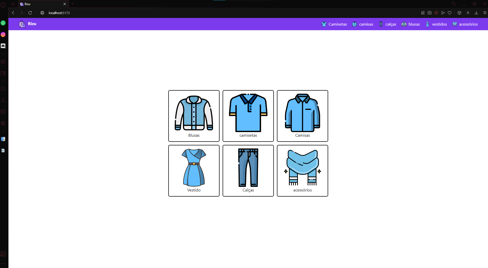
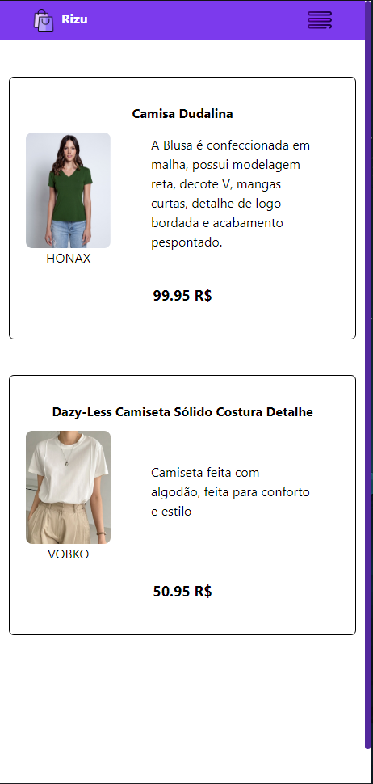
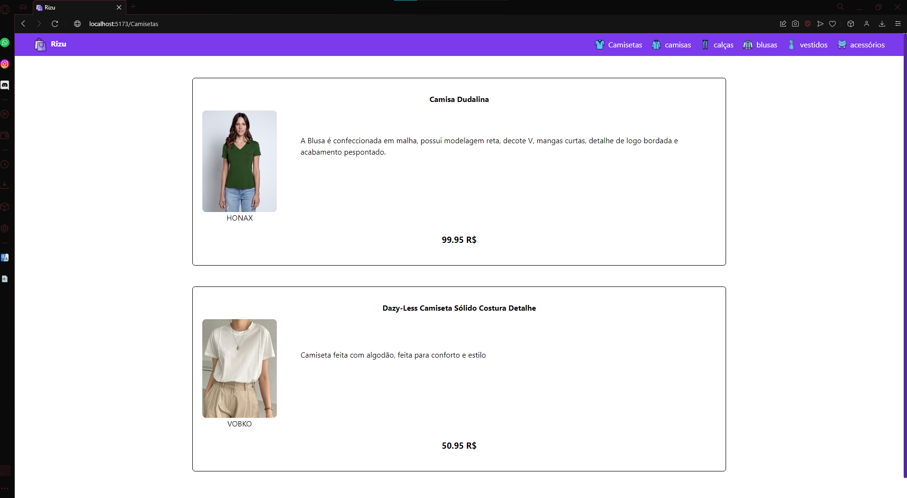

<h1 align="center">
  
</h1>

<h1 align="center">
 ✨ Tecnologias
</h1>

  

- [TypeScript](https://www.typescriptlang.org/)
- [React](https://reactjs.org/)
- [Fastify](https://www.fastify.io/)
- [Prisma](https://www.prisma.io/)
- E muitas outras…
 
<h1 align="center">
  📥 Requirements to install the project
</h1>

  1º: Node <a href='https://nodejs.org/en/'> Install </a>  

  2º: VScode <a href='https://code.visualstudio.com/download'> Install </a>  

  3º: Git <a href='https://git-scm.com/downloads'> Install </a>  

  

<h1 align="center">
  🖋️ Project
</h1>

  
  

  This was a frontEnd and backEnd project, whose objective is to make a list
  of daily habits and customs, great for making daily goals and objectives.

  

<h1 align="center">
  🙋‍♂️ Isaac Moretão 
</h1>

  I'm a Programming Student focused on ReactJs, I'm looking for my first job 
  as a programmer in the job market, you can see other projects of mine, on my GitHub profile,
  if you give me a star in this repository I would be very grateful, and if you can comment what you think you help me improve  

  

## 📝 License

Esse projeto está sob a licença MIT. Veja o arquivo [LICENSE](LICENSE) para mais detalhes.

---